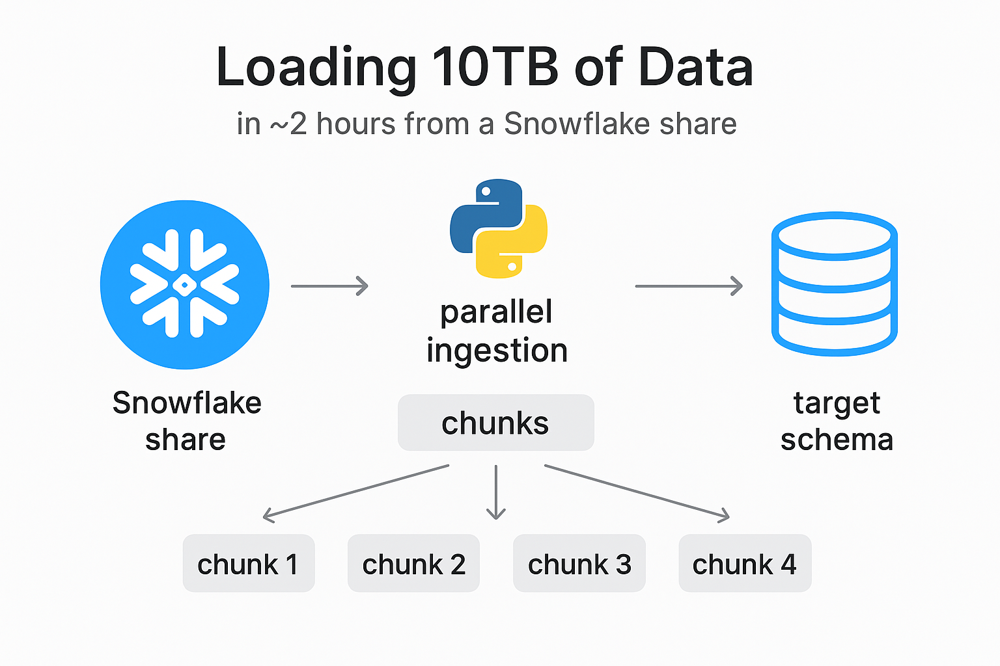
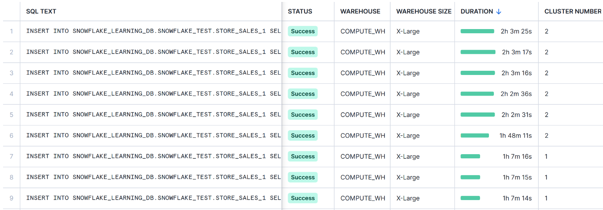

# 🚀 Snowflake Parallel Data Loader

A high-performance Python framework to **load 10TB of data from a Snowflake Share in just 2h 4ms** — powered by **parallel chunking, multi-threading, and config-driven orchestration**.

## ✨ Key Highlights
- ⚡ **Parallel ingestion** using Python `ThreadPoolExecutor`.
- 📊 **Smart chunking** to balance workload across threads.
- 📝 **Centralized logging** with per-thread row counts & job summary.
- 🔧 **Config-driven SQL** (YAML) for flexible pipeline control.
- 🔒 **Secrets in `.env`** — no hardcoded credentials.
- ✅ **Validation built-in** (source vs target row counts).


## 🖼️ Architecture




## 📂 Project Structure

```
snowflake_project/
├── main.py                # Entry point
├── data_ingestion.py      # Multi-threaded inserts
├── chunk_calc.py          # Chunk size calculator
├── chunk_summary.py       # Summary logs (per-thread + total)
├── source_row_count.py    # Source row count
├── validation.py          # Post-load validation
├── logger.py              # Central logging
├── utils.py               # Config + connection helpers
├── config/
│   ├── config.yaml        # SQL definitions (truncate, etc.)
│   └── settings.py        # Converting Snowflake credentials for easy read
├── .env                   # Snowflake credentials
├── docs/
│   ├── diagram.png        # Architecture diagram
│   └── test_results.png   # Screenshot of actual run
├── requirements.txt       # Python dependencies
└── logs/                  # Folder to save logs
```

## 🛠️ Benefits of Key Design Choices

### Hash Partitioning
- Ensures **even data distribution** across virtual warehouses.
- Improves **parallel insert performance** by minimizing data skew.
- Enhances **query performance** for analytical workloads.
- Reduces contention during **multi-threaded inserts**.

### `INSERT OVERWRITE INTO` vs `CREATE OR REPLACE TABLE`
- Updates target tables **without dropping them**, preserving table schema, constraints, and grants.
- Reduces downtime and **avoids locking issues** on large tables.
- Allows **incremental updates** efficiently without reloading the entire table from scratch.

## 📈 Results

✅ Successfully ingested 10TB from Snowflake share into target schema using a Snowflake Gen-1 XL (2-cluster) warehouse with a standard scaling policy (Screenshot below).

✅ End-to-end load completed in 2h 4ms.

✅ Automated summary logs with per-thread breakdown + total validation.

